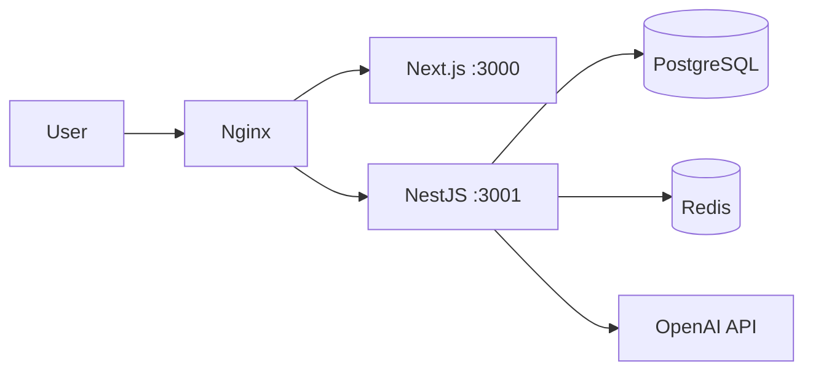

# Production deployment guide

Kids Edu Platform — monorepo (`apps/api`, `apps/web`, PostgreSQL, Redis, nginx).

## Quick start (Docker)

```bash
cp .env.production.example .env
# Edit secrets: POSTGRES_PASSWORD, JWT_*, OPENAI_API_KEY
chmod +x deploy/scripts/validate-env.sh
./deploy/scripts/validate-env.sh .env

docker compose -f docker-compose.prod.yml up -d --build
```

- App: `http://localhost` (nginx → web + `/api/v1` → API)
- Health: `GET /api/v1/health/live`, `GET /api/v1/health/ready`
- Metrics (if `METRICS_ENABLED=true`): `GET /api/v1/health/metrics`

Local dev stack with Redis:

```bash
docker compose up -d   # postgres + redis
```

---

## Production checklist

### Before deploy

- [ ] Copy `.env.production.example` → `.env`; run `./deploy/scripts/validate-env.sh .env`
- [ ] Set strong `POSTGRES_PASSWORD`, `JWT_ACCESS_SECRET`, `JWT_REFRESH_SECRET` (≥32 chars, not `change-me`)
- [ ] Set `CORS_ORIGIN` / `NEXT_PUBLIC_*` to real public URLs (comma-separated for multiple origins)
- [ ] `COOKIE_SECURE=true`, `COOKIE_SAME_SITE=lax` (or `strict`), set `COOKIE_DOMAIN` if needed
- [ ] `SWAGGER_ENABLED=false` in production
- [ ] `TRUST_PROXY=true` behind nginx/load balancer
- [ ] Redis reachable (`REDIS_URL`, `REDIS_ENABLED=true`)
- [ ] OpenAI key present if `AI_ENABLED=true`; set rate limits (`AI_RATE_LIMIT_*`)
- [ ] TLS termination (nginx/ALB/CDN) — add SSL config to nginx or use managed LB
- [ ] Backups for Postgres volume (`postgres_data`)
- [ ] CI green on `main` (lint, typecheck, build, Docker build)

### After deploy

- [ ] `GET /api/v1/health/ready` → `status: ok` (or `degraded` if Redis down)
- [ ] Login flow (cookies, CORS) from production web URL
- [ ] `prisma migrate deploy` succeeded (or `RUN_MIGRATIONS=true` in compose)
- [ ] Logs structured (JSON via pino in production)
- [ ] Monitor disk, memory, Redis memory, DB connections
- [ ] Set OpenAI usage alerts in OpenAI dashboard

### Security

- [ ] Helmet security headers on API
- [ ] nginx rate limits (`limit_req_zone` in `deploy/nginx/`)
- [ ] Global API throttle (`THROTTLE_LIMIT` / `THROTTLE_TTL_MS`)
- [ ] AI per-student rate limits (Redis-backed when Redis is up)
- [ ] `ValidationPipe`: whitelist + forbidNonWhitelisted
- [ ] No secrets in git; rotate JWT secrets on compromise
- [ ] Restrict `/docs` and `/health/metrics` at nginx if exposed publicly

---

## Architecture (production)



| Component | Role |
|-----------|------|
| **nginx** | TLS (optional), gzip, rate limit, security headers, reverse proxy |
| **web** | Next.js standalone, static assets |
| **api** | NestJS, JWT cookies, validation, AI, analytics |
| **postgres** | Primary data |
| **redis** | Cache (`@nestjs/cache-manager`) + distributed AI rate limits |

---

## Environment variables

See [`.env.production.example`](../.env.production.example) and [`apps/api/.env.example`](../apps/api/.env.example).

Boot-time validation: `validateEnv` in `apps/api/src/config/env.validation.ts` (fails fast on missing/weak secrets in production).

---

## CI/CD

| Workflow | Trigger | Purpose |
|----------|---------|---------|
| `.github/workflows/ci.yml` | push / PR | lint, typecheck, build, Docker build, env script check |
| `.github/workflows/deploy.yml` | tag `v*` / manual | build, `prisma migrate deploy`, deploy hook (wire to your host) |

Recommended pipeline:

1. CI on PR
2. On release tag: build images → push registry → run migrations → rolling update API → web
3. Smoke: `/health/ready`, login, one student test flow

---

## Logging

- **Library**: `nestjs-pino` + `pino-http`
- **Level**: `LOG_LEVEL` (`info` default)
- **Production**: JSON logs to stdout (collect with Loki/CloudWatch/Datadog)
- **Redacted**: `Authorization`, cookies

---

## Monitoring

| Endpoint | Use |
|----------|-----|
| `/api/v1/health/live` | Liveness — process up |
| `/api/v1/health/ready` | Readiness — DB (+ Redis status) |
| `/api/v1/health/metrics` | Basic memory/uptime (`METRICS_ENABLED=true`) |

Integrate with Prometheus/Grafana or your APM by scraping metrics or forwarding logs.

---

## Rate limiting

| Layer | Config |
|-------|--------|
| nginx | `deploy/nginx/nginx.conf` — 30 req/s API, 50 req/s web |
| NestJS Throttler | `THROTTLE_TTL_MS`, `THROTTLE_LIMIT` (global per IP) |
| AI module | `AI_RATE_LIMIT_PER_MINUTE`, `AI_RATE_LIMIT_PER_HOUR` (per student, Redis if available) |

---

## CORS & security headers

- **CORS**: `CORS_ORIGIN` — single URL or comma-separated list; `credentials: true` for cookies
- **Helmet**: enabled in `main.ts` (CSP in production)
- **nginx**: `X-Frame-Options`, `X-Content-Type-Options`, `Referrer-Policy`, `Permissions-Policy`

---

## API validation

Global `ValidationPipe` (whitelist, transform, forbid unknown fields). DTOs use `class-validator` on all inputs.

---

## Redis cache

- Module: `AppCacheModule` (`cache-manager-redis-yet`)
- TTL: `CACHE_TTL_SECONDS` (default 300s)
- Falls back to in-memory if Redis unavailable
- Use `CACHE_MANAGER` in services for expensive reads (e.g. analytics dashboards)

---

## Scalability notes

1. **Stateless API** — scale `api` replicas horizontally; require Redis for shared AI limits and cache
2. **Postgres** — connection pool per instance; consider PgBouncer at >3 API replicas
3. **Read replicas** — analytics raw SQL can target replica later
4. **Web** — CDN for `/_next/static`; multiple Next instances behind nginx
5. **Redis** — separate instance/cluster for prod; tune `maxmemory-policy`
6. **Background jobs** — move heavy AI batch work to a queue (BullMQ) if volume grows
7. **File uploads** — not in scope; use object storage + signed URLs if added

---

## Performance optimization

| Area | Action |
|------|--------|
| DB | Indexes on analytics migration; avoid N+1 in hot paths |
| API | `compression` middleware; cache analytics aggregates in Redis |
| Web | Next `output: 'standalone'`; static assets via CDN |
| nginx | gzip, keepalive upstreams, `limit_req` |
| Prisma | Select only needed fields; paginate list endpoints |
| Client | React Server Components where possible; lazy-load charts |

Load test with k6/Artillery on `/api/v1/auth/login`, student test submit, teacher analytics.

---

## OpenAI cost optimization

| Lever | Setting / practice |
|-------|-------------------|
| Model | `OPENAI_MODEL=gpt-4o-mini` (default) — avoid `gpt-4o` unless required |
| Disable AI | `AI_ENABLED=false` in staging |
| Rate limits | `AI_RATE_LIMIT_PER_MINUTE`, `AI_RATE_LIMIT_PER_HOUR` |
| Retries | `OPENAI_MAX_RETRIES=3`, exponential backoff in `OpenAiRetryService` |
| Token cap | Keep prompts concise in `PromptBuilderService`; cap `max_tokens` in `OpenAiClient` |
| Moderation | `OPENAI_MODERATION_MODEL` only on user-generated text |
| Caching | Cache identical test-analysis prompts by `attemptId` hash in Redis (TTL 24h) |
| Logging | `AiChatLogService` — audit usage; alert on spike |
| Business rules | Only call AI after test submit, not on every page view |
| Dashboard | OpenAI usage limits + billing alerts |

Estimated cost drivers: number of test submissions × tokens per assessment × model price.

---

## Manual deploy (without compose)

```bash
pnpm install --frozen-lockfile
pnpm db:generate
pnpm build
pnpm --filter @edu-platform/api exec prisma migrate deploy

# API
docker build -f apps/api/Dockerfile -t kids-edu-api .
docker run -p 3001:3001 --env-file .env kids-edu-api

# Web
docker build -f apps/web/Dockerfile \
  --build-arg NEXT_PUBLIC_API_URL=https://api.example.com/api/v1 \
  --build-arg NEXT_PUBLIC_APP_URL=https://app.example.com \
  -t kids-edu-web .
```

---

## Troubleshooting

| Symptom | Check |
|---------|--------|
| CORS errors | `CORS_ORIGIN` matches browser URL exactly |
| Cookies not set | `COOKIE_SECURE`, domain, `SameSite`, nginx forwards `X-Forwarded-Proto` |
| 429 AI | Rate limits; Redis connectivity |
| Ready fails | `DATABASE_URL`, Postgres health |
| Degraded ready | Redis down — API still runs; fix Redis for multi-instance |
